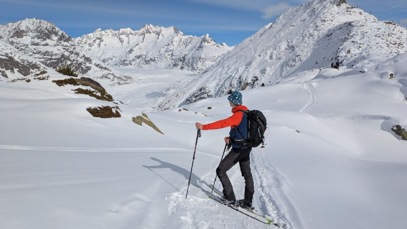

Eigentlich ist Fiescheralp in schweizer Wallis ein großes Skigebiet. Trotzdem findet sich die eine oder andere Tour für Freunde der Aufstiegs ohne Hilfe. So haben wir uns heute eine kleine Runde zum Ausblick auf den Aletschgletscher am Bettmerhorn ausgesucht. Zum Start rutscht man - nach kurzem Anstieg ohne Felle - auf dem Wanderweg Richtung Westen zur Bättmerhütte. Dort schnappen wir uns einen Haken eines kleinen Schlepplifts, der uns zehn Höhenmeter schenkt. Die breiten Skipisten querend schlagen wir uns zum Bettmersee durch, umrunden ihn und steigen dann in freiem Gelände Richtung Blausee an. Den lassen wir aber links liegen und wenden uns gen Nordosten parallel zur Seilbahn Moosfluh vorbei an deren Bergstation gerade Richtung Bettmerhorn. 

Das Ziel ist dabei immer im Blick und die Aussichten auf den Aletschgletscher überwältigend. 
An der Aussicht angekommen, kann man je nach Gusto und Schneelage auf Piste oder im Gelände Richtung Fiescheralp abfahren.

